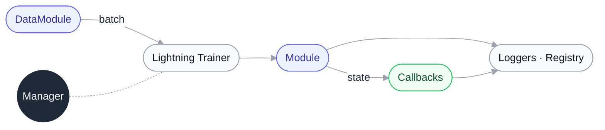
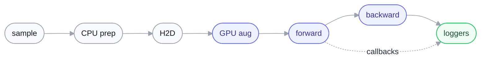

# stable-pretraining

[](https://galilai-group.github.io/stable-pretraining/)
[](https://github.com/galilai-group/stable-pretraining/tree/main/benchmarks)
[](https://github.com/galilai-group/stable-pretraining/actions/workflows/testing.yml)
[](https://pytorch.org/get-started/locally/)
[](#jax-backend)
[](https://github.com/astral-sh/ruff)
[](https://opensource.org/licenses/MIT)
[](https://wandb.ai/site)


**PyTorch Lightning for foundation-model research.** Dict-shaped state
so any intermediate tensor is loggable, live evaluation probes that
attach without touching the training loop (`OnlineProbe`, `OnlineKNN`,
`RankMe`, `LiDAR`, …), SLURM-grade requeue + atomic checkpoints +
queryable run registry, GPU-side batched augmentation, and 30+ ready
recipes spanning SSL, supervised, and multi-modal pretraining
(SimCLR, DINO/DINOv2, MAE, BYOL, VICReg, Barlow Twins, LeJEPA, CLIP, …).
An **experimental [JAX / Flax-NNX backend](#jax-backend)** mirrors the same
design (forward-dict, callbacks, SLURM-grade Manager) for users who prefer JAX.

[30-second tour ↓](#30s-tour) · [JAX backend ↓](#jax-backend) ·
[Built-in methods ↓](#built-in-methods) · [Discord](https://discord.gg/adzpqWKM25)

## Table of Contents

- [How?](#how)
- [Quick Setup](#quick-setup)
- [Tutorial Notebook](#quick-setup)
- [30-second tour](#30s-tour)
- [JAX backend (experimental)](#jax-backend)
- [Core Structure](#core-structure)
  - [Data](#data)
  - [Module](#module)
  - [Callbacks](#callbacks)
  - [Trainer](#trainer)
- [Global Configuration](#global-configuration)
- [Output Directory (`cache_dir`)](#output-directory)
- [Run Registry](#run-registry)
- [Built-in Methods](#built-in-methods)
- [Backbones](#backbones)
- [Optimizers & Schedulers](#optimizers-schedulers)
- [Complete Example](#complete-example)
- [Quick Start with `spt` CLI](#spt-cli)
- [Installation](#installation)
- [Contributing](#contributing)
- [Citation](#citation)
- [Contributors](#contributors)
- [Benchmarks](#benchmarks)

<a id="how"></a>
## How?

To reach flexibility, scalability and stability, we rely on battle-tested third party libraries: `PyTorch`, `Lightning`, `HuggingFace`, `TorchMetrics` amongst a few others. Those dependencies allow us to focus on assembling everything into a powerful ML framework. ``stable-pretraining`` adopts a flexible and modular design for seamless integration of components from external libraries, including architectures, loss functions, evaluation metrics, and augmentations.

<a id="quick-setup"></a>
## Quick setup

```bash
# Clone the repository
git clone https://github.com/galilai-group/stable-pretraining.git

# Install the framework
cd stable-pretraining
pip install -e .
```

For an interactive walkthrough — data loading, Module, callbacks, training, and evaluation all in one place — open the tutorial notebook:

```bash
jupyter notebook examples/simclr_cifar10_tutorial.ipynb
```

<a id="30s-tour"></a>
## 30-second tour

The whole framework is four components that pass **dicts** to each other.
Once you see the shape, the rest of the README is reference.



*Indigo* nodes are what you write (data + forward). *Green* is the
hook surface (callbacks). *Slate* is the orchestration that runs
underneath.

A minimal end-to-end run looks like this (substitute your own loader / loss):

```python
import lightning as pl
import stable_pretraining as spt

# 1. Data flows as dicts. CPU transforms decode + resize; random
#    augmentation can live on the GPU via `gpu_transform=` (optional).
train_ds = spt.data.HFDataset("cifar10", split="train", transform=...)
val_ds   = spt.data.HFDataset("cifar10", split="test",  transform=...)
dm = spt.data.DataModule(
    train=torch.utils.data.DataLoader(train_ds, batch_size=256, num_workers=8),
    val=torch.utils.data.DataLoader(val_ds, batch_size=256, num_workers=8),
)

# 2. Module = backbone + a forward function that returns a state dict.
#    `forward.simclr` (and friends) are pre-built; you can also
#    write your own — anything returning {"loss": ..., "embedding": ...}.
module = spt.Module(
    backbone=spt.backbone.from_timm("resnet18", num_classes=0),
    projector=spt.backbone.MLP(512, 512, 128),
    forward=spt.forward.simclr,
    simclr_loss=spt.losses.NTXEntLoss(temperature=0.5),
)

# 3. Callbacks watch the state dict and train online probes / log metrics
#    without touching the main loop.
trainer = pl.Trainer(max_epochs=100, precision="bf16-mixed", callbacks=[
    spt.callbacks.OnlineProbe(module, name="probe", input="embedding", target="label",
                              probe=nn.Linear(512, 10), loss=nn.CrossEntropyLoss()),
    spt.callbacks.OnlineKNN(name="knn", input="embedding", target="label",
                            queue_length=10_000, input_dim=512, k=20),
])

# 4. Manager wraps fit() with SLURM-requeue, atomic checkpoints, and
#    the run registry. On a workstation it's just a thin call; on a
#    cluster it adds preempt/resume + run tracking for free.
spt.Manager(trainer=trainer, module=module, data=dm)()
```

A single sample's journey through the stack:



Read left-to-right. *Slate* runs on CPU (decode, resize, pinned H2D).
*Indigo* runs on GPU — including the augmentation that traditionally
lived on CPU. The dotted arrow shows callbacks tapping the same state
dict the loss is computed from, without touching the loop.

The dict-everywhere design means callbacks attach without modifying the
training loop, GPU augmentation slots in via `dataset.gpu_transform=`
(see [§GPU-side batched augmentation](#data)), and any intermediate
quantity in the state dict is automatically available to loggers.

<a id="jax-backend"></a>
## JAX backend (experimental)

A parallel **JAX / [Flax-NNX](https://flax.readthedocs.io/en/latest/nnx/)**
backend lives under `stable_pretraining.jax` (install with `pip install -e ".[jax]"`).
It is **opt-in and isolated** — `import stable_pretraining` never imports JAX —
and it mirrors the torch design: a stateless `forward(self, batch, stage)` that
returns a state **dict**, callbacks that read that dict under the same
Lightning-style hooks, and a `Manager` with the same `cache_dir` run-dir layout
+ SLURM preempt/requeue + atomic checkpoints. The engine underneath is
JAX-native (`nnx.value_and_grad` + `optax`, `nnx.jit`), and metrics are plain
`jnp`/NumPy — **no torchmetrics**.

The same minimal SimCLR run, side by side:

```python
# ---- PyTorch / Lightning -------------------     # ---- JAX / Flax-NNX ----------------------------
import stable_pretraining as spt                    import stable_pretraining.jax as spj
import torch, lightning as pl                       from flax import nnx
                                                     rngs = nnx.Rngs(0)
module = spt.Module(                                 module = spj.Module(
    forward=spt.forward.simclr,                          forward=spj.forward.simclr,
    backbone=spt.backbone.from_torchvision(              backbone=spj.backbone.resnet18(
        "resnet18", low_resolution=True),                    rngs=rngs, low_resolution=True),
    projector=torch.nn.Linear(512, 128),                 projector=spj.backbone.MLP(512, [128], rngs=rngs),
    simclr_loss=spt.losses.NTXEntLoss(0.5),              simclr_loss=spj.losses.NTXEntLoss(0.5),
    optim={"optimizer": {"type": "LARS",                 optim={"type": "lars",
                         "lr": 5}},                                 "learning_rate": 5.0},
)                                                    )
probe = spt.OnlineProbe(module, name="probe",        probe = spj.OnlineProbe("probe",
    input="embedding", target="label",                   probe=nnx.Linear(512, 10, rngs=rngs))
    probe=torch.nn.Linear(512, 10),
    loss=torch.nn.CrossEntropyLoss())
trainer = pl.Trainer(max_epochs=100,                 trainer = spj.Trainer(max_epochs=100,
                     callbacks=[probe])                                    callbacks=[probe])
spt.Manager(trainer=trainer, module=module,          spj.Manager(trainer, module,
            data=dm)()                                           train_loader, val_loader)()
```

**Multi-GPU** is one flag — `spj.Trainer(..., data_parallel=True)` shards each
batch across all visible devices (SPMD); **bf16** mixed precision is
`dtype=jnp.bfloat16` on the backbone.

**What's available today:** methods SimCLR / VICReg / Barlow Twins / SimSiam /
BYOL; backbones MLP / ResNet-{9,18,34,50,101,152} / ConvMixer / ViT-{tiny,small,
base,large}; losses NT-Xent / InfoNCE / BYOL / VICReg / Barlow Twins / SwAV-Sinkhorn /
neg-cosine; callbacks `OnlineProbe`, `OnlineKNN`, `RankMe`, `LiDAR`,
`OnlineQueue`, `OnlineWriter`, `EarlyStopping`, EMA `TeacherStudentCallback`;
checkpointing + exact resume; on-device augmentation (`spj.augment`). Every
torch↔JAX numerical claim above is covered by parity regression tests.

**Logging is identical to the torch path** — not reimplemented. The JAX
`Trainer` drives the *same* logger classes (`RegistryLogger`, WandB, Trackio,
SwanLab) via `logger=`, `Module.log(name, value)` matches, and metric keys are
the same (`fit/loss`, `train/<p>_loss`, `eval/<p>_acc`, bare `rankme`/`lidar`, …).
`spj.Manager` auto-attaches the `RegistryLogger`, so JAX runs write the same
`sidecar.json` and show up in `spt registry ls/best/...` exactly like torch runs.
Metrics use plain `jnp`/NumPy — no torchmetrics.

**Still pending (vs the torch path):** DINO/DINOv2/MAE/I-JEPA methods, the full
ViT feature set (SwiGLU/QK-norm/RoPE), video backbones, and a few niche
callbacks. Contributions welcome.

<a id="core-structure"></a>
## Core Structure

`stable-pretraining` simplifies complex ML workflows into 4 intuitive components:

<a id="data"></a>
### 1 - Data
Your dataset must follow a dictionary-structured format where each sample is a dictionary with named fields (e.g., `{"image": ..., "label": ...}`). This ensures consistent behavior across all components. You have multiple options for creating datasets:

- **HuggingFace datasets** (if available on the Hub):
```python
import stable_pretraining as spt
train_dataset = spt.data.HFDataset(
    path="frgfm/imagenette",
    name="160px",
    split="train",
    transform=train_transform,
)
```

- **From PyTorch datasets**:
```python
train_dataset = spt.data.FromTorchDataset(
    torchvision_dataset,
    names=["image", "label"],  # Map tuple outputs to dictionary keys
    transform=train_transform,
)
```

- **Custom datasets**: Any dataset that returns dictionaries

```python
datamodule = spt.data.DataModule(train=train_dataloader, val=val_dataloader)
```

#### GPU-side batched augmentation (`gpu_transform`)

SSL augmentation traditionally runs per-sample in DataLoader workers
(PIL + torchvision). On modern accelerators that becomes the
bottleneck: CPU workers can't keep up with the GPU on heavy multi-view
recipes. Moving augmentation to the GPU via
[kornia](https://kornia.readthedocs.io/) inside Lightning's
`on_after_batch_transfer` hook vectorises it across the batch and
frees CPU workers to do more I/O in parallel.

We measure substantial end-to-end throughput improvements across
model sizes and precisions — see
[`benchmarks/imagenet10/RESULTS.md`](benchmarks/imagenet10/RESULTS.md)
for the full sweep (ViT-S/16, ViT-L/16; fp16 / bf16 / FP8;
torch.compile on/off; various batch sizes).

##### Before — torchvision augmentation in CPU workers

The historical SSL recipe: every random transform runs per-sample
inside the DataLoader workers. `MultiViewTransform` produces both
views on the CPU side.

```python
from stable_pretraining.data import transforms
import stable_pretraining as spt

train_transform = transforms.MultiViewTransform([
    transforms.Compose(                        # view 1
        transforms.RGB(),
        transforms.RandomResizedCrop((224, 224), scale=(0.08, 1.0)),
        transforms.ColorJitter(0.4, 0.4, 0.2, 0.1, p=0.8),
        transforms.RandomGrayscale(p=0.2),
        transforms.PILGaussianBlur(p=1.0),
        transforms.RandomHorizontalFlip(p=0.5),
        transforms.ToImage(**spt.data.static.ImageNet),
    ),
    transforms.Compose(                        # view 2 — same recipe
        transforms.RGB(),
        transforms.RandomResizedCrop((224, 224), scale=(0.08, 1.0)),
        transforms.ColorJitter(0.4, 0.4, 0.2, 0.1, p=0.8),
        transforms.RandomGrayscale(p=0.2),
        transforms.PILGaussianBlur(p=1.0),
        transforms.RandomHorizontalFlip(p=0.5),
        transforms.ToImage(**spt.data.static.ImageNet),
    ),
])

train_ds = spt.data.HFDataset(
    "frgfm/imagenette", split="train",
    transform=train_transform,
)
```

##### After — same augs, batched on the GPU

The CPU transform shrinks to "decode + resize". The augmentation chain
runs on the GPU, and `StackedMultiView` produces N views from one
source tensor in a single chain call (symmetric SSL — Barlow Twins,
SimCLR, VICReg, NNCLR, LeJEPA).

```python
from stable_pretraining.data import transforms, gpu_transforms as gt
import stable_pretraining as spt

# CPU side: just decode + resize. rgb=True folds in the old RGB() call.
cpu_transform = transforms.Compose(
    transforms.Resize((256, 256)),
    transforms.ToImage(rgb=True, scale=True),
)

# GPU side: same six augs, batched on device.
train_aug = gt.StackedMultiView(
    gt.GPUCompose([
        gt.GPURandomResizedCrop(size=224, scale=(0.08, 1.0)),
        gt.GPURandomHorizontalFlip(p=0.5),
        gt.GPUColorJitter(0.4, 0.4, 0.2, 0.1, p=0.8),
        gt.GPURandomGrayscale(p=0.2),
        gt.GPUGaussianBlur(kernel_size=23, p=0.5),
        gt.GPUNormalize(mean=[0.485, 0.456, 0.406], std=[0.229, 0.224, 0.225]),
    ]),
    n_views=2,        # use 8 for LeJEPA multi-view; or use gt.MultiView([c1, c2, ...]) for asymmetric methods like BYOL / DINO
)

train_ds = spt.data.HFDataset(
    "frgfm/imagenette", split="train",
    transform=cpu_transform,
    gpu_transform=train_aug,   # ← new arg; everything else stays the same
)
# val_ds: no gpu_transform — validation is already normalized on CPU.
```

##### What changed

| Concern | Before | After |
|---|---|---|
| Where random aug runs | per-sample, CPU workers | per-batch, GPU |
| Decode / RGB / resize | CPU | CPU (unchanged) |
| View fan-out | `MultiViewTransform([t1, t2, ...])` on CPU | `gt.StackedMultiView(chain, n_views=N)` on GPU |
| Dataset arg | `transform=...` | `transform=...` + `gpu_transform=...` |
| Module / Trainer code | unchanged | unchanged |
| Loss / metrics | unchanged | unchanged |

`Module.on_after_batch_transfer` discovers `gpu_transform` through
the active DataLoader. Resolution order: `dataset.gpu_transform` (1)
→ `datamodule.gpu_transform` (2, callable or `{"train": ..., "val": ...}`
dict for third-party datasets you can't modify). Setting it on the
Module is rejected at `on_train_start` — two routes to the same thing
is a footgun. The resolved transform is auto-moved to `self.device`
on first use (DDP-safe) and dropped during dataset pickling so
DataLoader workers never serialise the nn.Module.

<a id="module"></a>
### 2 - Module
The key differentiator from PyTorch Lightning - **you only define the `forward` function**, not `training_step`! This unified approach computes losses and generates useful quantities that can be retrieved for monitoring and analysis:

```python
# Use the pre-built forward functions from stable_pretraining
from stable_pretraining import forward

# Simply use the appropriate forward for your method
module = spt.Module(
    backbone=backbone,
    projector=projector,
    forward=forward.simclr,  # Or byol, vicreg, etc.
    simclr_loss=spt.losses.NTXEntLoss(temperature=0.5),
    optim={
        "optimizer": {"type": "Adam", "lr": 0.001},
        "scheduler": {"type": "CosineAnnealingLR"},
        "interval": "epoch"
    }
)
```

Or define your own custom forward:
```python
def forward(self, batch, stage):
    out = {}

    if isinstance(batch, list):
        # Multi-view training - batch is a list of view dicts
        embeddings = [self.backbone(view["image"]) for view in batch]
        out["embedding"] = torch.cat(embeddings, dim=0)

        if self.training:
            projections = [self.projector(emb) for emb in embeddings]
            out["loss"] = self.simclr_loss(projections[0], projections[1])
    else:
        # Single-view validation
        out["embedding"] = self.backbone(batch["image"])

    return out
```

**Key points:**
- The `forward` method defines both the loss and any quantities to monitor
- No need to override `training_step`, `validation_step`, etc.
- Return a dictionary with a `"loss"` key for training
- All model components are passed as kwargs to `spt.Module`

<a id="callbacks"></a>
### 3 - Callbacks

Monitor and evaluate your models in real-time during training. Callbacks are key ingredients of `stable-pretraining`, providing rich insights without interrupting your training flow.

#### Evaluation & Monitoring

| Callback | Description |
|----------|-------------|
| `OnlineProbe` | Trains a lightweight linear probe on frozen representations to track downstream task accuracy in real-time. Maintains its own optimizer and training loop. |
| `OnlineKNN` | Non-parametric k-nearest neighbors evaluator using a rolling queue of cached embeddings. Zero training cost. |
| `RankMe` | Tracks effective rank of feature representations via singular values. A rank drop signals dimensional collapse. |
| `LiDAR` | Linear Discriminant Analysis Rank over surrogate classes of augmented views. |
| `CLIPZeroShot` | Zero-shot classification for CLIP-style models. Compares image embeddings against text-encoded class names. |
| `ImageRetrieval` | Image retrieval evaluator following the DINO protocol with query/gallery splits. |
| `LatentViz` | Online 2D visualization of the latent space. Learns a neighborhood-preserving projection and periodically plots it. |
| `EpochMilestones` | Early-stops training if a metric fails to reach a threshold by a given epoch. |

#### Training Utilities

| Callback | Description |
|----------|-------------|
| `TeacherStudentCallback` | Auto-discovers `TeacherStudentWrapper` instances and performs EMA teacher updates at configurable frequency. |
| `WeightDecayUpdater` | Updates weight decay on a per-batch schedule (constant, linear, cosine, or exponential). |
| `EmbeddingCache` | Hooks into named submodules to cache intermediate embeddings for downstream use. |

#### Checkpointing & Export

| Callback | Description |
|----------|-------------|
| `SklearnCheckpoint` | Saves and restores scikit-learn models (probes, classifiers) inside Lightning checkpoints. |
| `WandbCheckpoint` | Uploads checkpoints to Weights & Biases as artifacts with run-resume support. |
| `StrictCheckpointCallback` | Controls strict/non-strict checkpoint loading with detailed mismatch reporting. |
| `HuggingFaceCheckpointCallback` | Exports HuggingFace-compatible checkpoints for any `PreTrainedModel` submodule (zero-knowledge reload). |

#### System & Logging

| Callback | Description |
|----------|-------------|
| `LoggingCallback` | Displays validation metrics in a color-coded formatted table after each epoch. |
| `ModuleSummary` | Logs detailed parameter statistics (trainable, frozen, per-layer) at the start of training. |
| `TrainerInfo` | Links trainer to DataModule and logs trainer configuration. |
| `SLURMInfo` | Extracts and logs SLURM environment information (job ID, partition, resources). |
| `EnvironmentDumpCallback` | Dumps Python version, CUDA info, installed packages, git state, and env vars to `environment.json` for exact reproducibility. |
| `LogUnusedParametersOnce` | Reports parameters that receive no gradient after the first backward pass. Useful for catching wiring bugs. |
| `CleanUpCallback` | Removes selected training artifacts (SLURM logs, Hydra files, checkpoints, etc.) after successful training. Keeps everything on failure for debugging. |
| `ModuleRegistryCallback` | Registers the module for global logging access. Enables `spt.log()` and `spt.log_dict()` from anywhere. |

#### Intelligent Queue System

Callbacks that need rolling feature stores (`OnlineKNN`, `RankMe`, `LiDAR`, `LatentViz`) share memory through an automatic queue management system. If two callbacks monitor the same key with different queue lengths, a single queue is allocated at the maximum length and shared, eliminating redundant computation.

**Why callbacks matter:** Get real-time feedback on representation quality, catch issues like collapse early, and track multiple metrics simultaneously. For detailed usage and practical considerations, see the [Callback guide](https://github.com/rbalestr-lab/stable-pretraining/blob/main/stable_pretraining/callbacks/README.md).

**Example:**
```python
# Monitor SSL representations with a linear classifier
linear_probe = spt.callbacks.OnlineProbe(
    module,
    name="linear_probe",
    input="embedding",
    target="label",
    probe=torch.nn.Linear(512, 10),
    loss_fn=torch.nn.CrossEntropyLoss(),
    metrics={
        "top1": torchmetrics.classification.MulticlassAccuracy(10),
        "top5": torchmetrics.classification.MulticlassAccuracy(10, top_k=5),
    },
)

# Track representation quality with KNN evaluation
knn_probe = spt.callbacks.OnlineKNN(
    name="knn_probe",
    input="embedding",
    target="label",
    queue_length=20000,
    k=10,
)
```

<a id="trainer"></a>
### 4 - Trainer
Orchestrate everything together with PyTorch Lightning's `Trainer`:

```python
trainer = pl.Trainer(
    max_epochs=10,
    num_sanity_val_steps=1,
    callbacks=[linear_probe, knn_probe, rankme],  # Your monitoring callbacks
    precision="16-mixed",
    logger=False,
    enable_checkpointing=False,
)
manager = spt.Manager(trainer=trainer, module=module, data=data)
manager()
```

Once configured, the `Manager` connects all components and handles the training loop with precise logging and monitoring (optional).

### Sharded training: FSDP2 & DeepSpeed

For large models, shard parameters/gradients/optimizer state across GPUs by flipping a single trainer switch — no changes to your method, forward, or model. **FSDP2** (`strategy="fsdp2"`) is the recommended path: it supports the full library (including teacher/student EMA and the online-probe callbacks) and is verified numerically equivalent to DDP. **DeepSpeed** ZeRO-3 (`strategy="deepspeed_stage_3"`, install `".[deepspeed]"`) is *partially* supported — single-optimizer methods only; it hard-errors with multiple optimizers, so it can't be used with EMA methods or the online probes (use FSDP2 there). See [`docs/source/fsdp2.rst`](docs/source/fsdp2.rst).

```python
trainer = pl.Trainer(strategy="fsdp2", precision="bf16-mixed", accelerator="gpu", devices=8)
```

Practical notes:

- **The strategy string is the only code change** — your model, forward, optimizer, and callbacks are untouched.
- **Precision:** use `"bf16-mixed"` — FSDP2's `ModelParallelStrategy` rejects `"16-mixed"`.
- **DeepSpeed:** `pip install -e ".[deepspeed]"` first; it's **single-optimizer only** (online probes / EMA methods raise a clear error pointing you back to FSDP2).
- **Launching on SLURM:** start one task per GPU — `srun --ntasks=8 --gres=gpu:8 --ntasks-per-node=8 python train.py` — because Lightning derives the world size from `SLURM_NTASKS`, not `devices=`. Off SLURM, just set `devices=8` and Lightning spawns the workers itself.
- **Debugging:** when sharding is active, the log prints an `FSDP2 configure_model` header, the resolved strategy summary (`{fsdp2: True, data_parallel_size: 8, ...}`), and which subtrees were sharded — so you can confirm at a glance that it's sharding over the expected number of ranks.

Sharding trades a little throughput for memory; the per-GPU saving scales with model size and rank count (`(R−1)/R × (params + grads + optimizer state)`). On a small model the saved state is dwarfed by activations (which sharding does not touch), so the win looks modest — but it grows fast with scale. Measured on Imagenette, H200, bf16:

**ViT-L/16 (300M), 2 GPUs, batch 256** — small model, modest gap:

| strategy | peak mem/GPU | img/s | notes |
|---|---|---|---|
| DDP | 90.5 GiB | 960 | full replica per GPU |
| FSDP2 | 87.7 GiB | 930 | balanced default; full library support |
| DeepSpeed ZeRO-3 | 77.7 GiB | 703 | more memory saved, lower throughput; single-optimizer only |

**ViT-e/14 (3.8B), 8 GPUs, batch 16** — large model, the gap is decisive:

| strategy | peak mem/GPU | img/s | notes |
|---|---|---|---|
| DDP | 113.1 GiB | 225 | replicates the full ~76 GiB of params+grads+optimizer state on every GPU |
| FSDP2 | 62.2 GiB | 214 | shards that state 8 ways → **−45% memory** for ~4% throughput |
| DeepSpeed ZeRO-3 | 46.6 GiB | 83 | shards most aggressively (**−59% memory**) but ~2.6× slower than FSDP2 here; single-optimizer only |

At batch 64 *both* DDP and FSDP2 OOM (activations, which neither shards, become the wall) — combine sharding with activation checkpointing for the largest models. The trade-off sharpens with scale: FSDP2 is the throughput-friendly default, while DeepSpeed ZeRO-3 buys the most memory headroom at a real speed cost.

<a id="global-configuration"></a>
## Global Configuration

Instead of scattering options across environment variables, callback constructors, and factory functions, `stable-pretraining` provides a single entry-point to configure library-wide behavior:

```python
import stable_pretraining as spt

spt.set(
    verbose="WARNING",                          # Global log level (also controls callback verbosity)
    progress_bar="rich",                        # "auto", "rich", "simple", or "none"
    cleanup={"checkpoints": False, "slurm": False},  # What CleanUpCallback removes
    log_rank="all",                             # Which distributed rank(s) may log (default: 0)
    default_callbacks={"env_dump": False},       # Toggle individual default callbacks on/off
)

# Inspect the current configuration
print(spt.get_config())
```

| Setting | Type | Default | Description |
|---------|------|---------|-------------|
| `verbose` | `str` or `int` | `"INFO"` | Loguru log level. Accepts `"DEBUG"`, `"INFO"`, `"WARNING"`, etc., or Python logging ints (`10`, `20`, `30`). Also controls the `verbose` flag on all callbacks when left at their default. |
| `progress_bar` | `str` | `"auto"` | Progress bar style. `"auto"` picks `"rich"` for TTYs and `"simple"` for non-interactive environments. `"none"` disables it. |
| `cleanup` | `dict` | keeps checkpoints & logs | Controls which artifact categories `CleanUpCallback` removes after training. Keys: `"checkpoints"`, `"logs"`, `"hydra"`, `"slurm"`, `"env_dump"`, `"callback_artifacts"`. Values are bools (`True` = keep, `False` = delete). |
| `log_rank` | `int` or `"all"` | `0` | Which distributed rank(s) may produce log output. |
| `default_callbacks` | `dict` | all enabled | Toggle individual default callbacks: `"progress_bar"`, `"registry"`, `"logging"`, `"env_dump"`, `"trainer_info"`, `"sklearn_checkpoint"`, `"wandb_checkpoint"`, `"module_summary"`, `"slurm_info"`, `"unused_params"`, `"hf_checkpoint"`. |
| `default_loggers` | `dict` | all enabled | Toggle default loggers: `"registry"` (SQLite run registry + per-step CSV logger, added as a pair). |
| `cache_dir` | `str` or `None` | `None` (or `SPT_CACHE_DIR` env var) | Root directory for all training outputs. See [Output Directory](#output-directory-cache-dir) below. |
| `requeue_checkpoint` | `bool` | `True` | Auto-add a `last.ckpt` checkpoint every epoch for SLURM requeue. Set to `False` to save time/disk when preemption is not a concern. Only applies when `cache_dir` is set. |

Settings apply immediately and persist for the process lifetime. `spt.set()` can be called multiple times; only the settings you pass are updated.

<a id="output-directory"></a>
(output-directory-cache-dir)=
## Output Directory (`cache_dir`)

By default, Lightning and Hydra scatter training outputs (checkpoints, logs, wandb data) based on the current working directory or Hydra's `run.dir`. This causes collisions when multiple sweep jobs start at the same time and resolve to the same path.

`stable-pretraining` solves this with a centralized `cache_dir`. When set, **every run gets its own unique directory** and all outputs are routed there automatically:

```
{cache_dir}/runs/{YYYYMMDD}/{HHMMSS}/{run_id}/
├── checkpoints/last.ckpt
├── wandb_resume.json
├── run_meta.json
├── environment.json
└── ...
```

### Enabling `cache_dir`

```python
import stable_pretraining as spt

# Option 1: in Python
spt.set(cache_dir="~/.cache/stable_pretraining")

# Option 2: via environment variable (e.g. in ~/.bashrc)
# export SPT_CACHE_DIR=~/.cache/stable_pretraining
```

When `cache_dir` is set, the Manager:
1. Creates a unique run directory under `cache_dir/runs/`.
2. Sets the Trainer's `default_root_dir` to that directory (before instantiation).
3. Redirects **all** `ModelCheckpoint` callbacks to `run_dir/checkpoints/` (preserving their filename, monitor, and other settings).
4. Adds a requeue checkpoint (`last.ckpt`, saved every epoch) for seamless SLURM preemption recovery. You never need to add one yourself.
5. Routes all callback outputs (environment dumps, latent visualizations, HuggingFace exports, etc.) there.

If preemption is not a concern and you want to skip the requeue checkpoint overhead:
```python
spt.set(cache_dir="/scratch/runs", requeue_checkpoint=False)
```

When `cache_dir` is not set (`None`, the default), the library behaves exactly as before.

### How the run ID is generated

The run ID is chosen to be **deterministic across all ranks of the same job**, so multi-GPU training always agrees on a single directory:

| Environment | Run ID | Example |
|---|---|---|
| SLURM | `SLURM_JOB_ID` | `99999` |
| SLURM array job | `SLURM_JOB_ID_SLURM_ARRAY_TASK_ID` | `99999_3` |
| torchrun | `TORCHELASTIC_RUN_ID` | `abc123` |
| Local / other | Random UUID (12 hex chars) | `a1b2c3d4e5f6` |

### `ckpt_path` is for loading only

`ckpt_path` and `cache_dir` serve different purposes:

- **`ckpt_path`** = where to **load** weights from (one-time, read-only).
- **`cache_dir`** = where to **save** everything going forward.

```python
manager = spt.Manager(
    trainer=trainer_cfg,
    module=module,
    data=data,
    ckpt_path="/old/run/pretrained.ckpt",  # Load from here once
)
# New checkpoints, logs, wandb data → cache_dir/runs/.../
```

If you don't pass `ckpt_path`, the system checks `run_dir/checkpoints/last.ckpt` automatically. This means **SLURM requeue works without any user configuration**: the job is preempted, restarted with the same `SLURM_JOB_ID`, finds its previous run directory, and resumes from the last checkpoint.

### Hydra compatibility

When `cache_dir` is active, Hydra's `run.dir`, `sweep.dir`, and `job.chdir` settings are ignored for trainer outputs (a warning is logged). Hydra still manages its own `.hydra/` config dumps as usual. Note that SLURM `.out`/`.err` files are created by the scheduler before Python starts and cannot be redirected into the run directory.

<a id="run-registry"></a>
## Run Registry

When `cache_dir` is set, `stable-pretraining` automatically maintains a **filesystem-backed run registry** that indexes every run. Think of it as a local, offline, instant-query alternative to the wandb dashboard — designed for large sweeps on HPC clusters.

There is **nothing to configure** — if `cache_dir` is set, the registry is active:

```python
import stable_pretraining as spt

spt.set(cache_dir="/scratch/runs")
# That's it. Every run writes a sidecar.json into its run directory.
```

### Architecture

The registry uses a **filesystem-first sidecar pattern**. During training, each run writes only plain files — no SQLite, no network I/O:

```
{run_dir}/
  sidecar.json    ← atomic JSON snapshot (hparams, summary, status, tags)
  heartbeat       ← empty file, mtime touched every flush (liveness signal)
  metrics.csv     ← CSVLogger per-step time series
  hparams.yaml    ← CSVLogger hparams
  checkpoints/    ← Lightning checkpoints
```

The `sidecar.json` is the **source of truth** for each run. It is atomically rewritten (tmp + fsync + rename) so readers never see a partial file. A separate **scanner** (`spt registry scan`) walks `{cache_dir}/runs/**/sidecar.json` and builds a SQLite cache (`registry.db`) for fast querying. This cache is fully derived — deleting it is harmless; run `spt registry scan --full` to rebuild.

This design eliminates all SQLite contention during training: thousands of concurrent SLURM jobs write only to their own run directory and never touch a shared database.

### What gets stored

The registry captures three categories of data per run, all automatically:

- **Config / hparams** — the full Hydra config (trainer, module, data) is flattened into dot-separated keys (e.g. `module.optim.optimizer.lr`, `trainer.max_epochs`) and stored as both `config` and `hparams`. This works the same way as wandb's config: the Manager flattens the Hydra DictConfig and injects it into `module.save_hyperparameters()` before `trainer.fit()`, so Lightning's built-in `_log_hyperparams` sends it to **all** loggers (wandb, CSV, TensorBoard, and the registry) automatically.
- **Summary** — every `self.log()` call in your LightningModule accumulates into a wandb-style summary dict (last value per metric key). At the end of training, the final summary (e.g. `{"val_acc": 0.85, "train_loss": 0.12}`) is written to the sidecar.
- **Metadata** — run ID, status (`running`/`completed`/`failed`/`orphaned`), liveness (heartbeat-based), tags, notes, `run_dir` path, and best checkpoint path.

### Grouping with tags

All grouping is done through **tags** — a flat list of strings attached to each run. There is no separate "project" or "group" concept; `cache_dir` already acts as the project, and tags handle everything else.

For SLURM array jobs, a `"sweep:<SLURM_ARRAY_JOB_ID>"` tag is automatically added so that all tasks in the same array are queryable as a group. You can add your own tags in YAML:

```yaml
logger:
  - _target_: stable_pretraining.registry.RegistryLogger
    tags: [resnet50, simclr, ablation-v2]
    notes: "Testing higher learning rates"
```

### Querying runs

`open_registry()` triggers an incremental scan of the filesystem before returning, so the cache reflects the current state. A short in-process TTL ensures back-to-back queries don't re-scan.

```python
import stable_pretraining as spt

spt.set(cache_dir="/scratch/runs")
reg = spt.open_registry()

# All completed runs from a SLURM array sweep
best = reg.query(tag="sweep:12345", status="completed", sort_by="summary.val_acc", limit=5)
for r in best:
    print(f"{r.run_id}: val_acc={r.summary['val_acc']:.3f}  lr={r.hparams['module.optim.optimizer.lr']}")

# Load the best checkpoint directly
import torch
ckpt = torch.load(best[0].checkpoint_path)

# Filter by any Hydra config key (deeply nested keys work)
lars_runs = reg.query(hparams={"module.optim.optimizer.type": "LARS"})

# Check which runs are still alive (heartbeat-based)
active = reg.query(alive=True)

# All resnet runs as a pandas DataFrame
df = reg.to_dataframe(tag="resnet50")
# Columns include flattened hparams and summary:
#   run_id, status, alive, tags, notes, checkpoint_path,
#   hparams.module.optim.optimizer.lr, hparams.trainer.max_epochs,
#   summary.val_acc, summary.train_loss, ...

# Quick analysis
df[["run_id", "hparams.module.optim.optimizer.lr", "summary.val_acc"]].sort_values(
    "summary.val_acc", ascending=False
).head(10)
```

### Concurrency and SLURM requeue

Since training jobs only write to their own run directory (plain files, no shared database), there is zero SQLite contention — thousands of concurrent SLURM jobs run safely with no coordination. The scanner is the sole SQLite writer and uses WAL mode so concurrent readers never block it. On SLURM requeue, the run ID is deterministic (derived from `SLURM_JOB_ID`), so the requeued job finds its previous sidecar and resumes seamlessly — the same mechanism used for wandb run resumption and checkpoint recovery.

### Liveness detection

The registry tracks whether a run is alive via a **heartbeat** file (an empty file whose mtime is touched on every `log_metrics` call). The scanner considers a run alive if its heartbeat is newer than 180 seconds and its status is not terminal. This lets you distinguish running, stalled, and dead jobs without contacting SLURM:

```bash
# Only alive runs
spt registry ls --alive

# Only dead/finished runs
spt registry ls --dead
```

### CLI

The `spt registry` command lets you query runs from the terminal:

```bash
# List all runs
spt registry ls

# Filter by tag, status, or liveness
spt registry ls --tag resnet50 --status completed
spt registry ls --alive

# Top 5 runs by a metric (use --asc for losses)
spt registry best val_acc
spt registry best train_loss --asc -n 10

# Show full details for a run (config, summary, tags)
spt registry show <run_id>

# Export to CSV or Parquet
spt registry export sweep_results.csv --tag sweep:12345

# Manually refresh the SQLite cache from sidecars
spt registry scan
spt registry scan --full  # re-ingest everything (schema migration, DB rebuild)

# Migrate from a legacy server-backed registry.db
spt registry migrate /path/to/old/registry.db --cache-dir /scratch/runs
```

By default the CLI uses `$SPT_CACHE_DIR/registry.db` (or the `spt.set(cache_dir=...)` value). Pass `--db /path/to/registry.db` and/or `--cache-dir` to override.

### Disabling the registry

```python
spt.set(default_loggers={"registry": False})
```

<a id="built-in-methods"></a>
## Built-in Methods

`stable-pretraining` ships with ready-to-use forward functions and matching loss functions for popular self-supervised learning methods:

| Method | Forward fn | Loss | Description |
|--------|-----------|------|-------------|
| Supervised | `forward.supervised` | any | Standard supervised training with labels |
| SimCLR | `forward.simclr` | `NTXEntLoss` | Contrastive learning with 2 augmented views |
| BYOL | `forward.byol` | `BYOLLoss` | Momentum-based self-distillation without negatives |
| VICReg | `forward.vicreg` | `VICRegLoss` | Variance-invariance-covariance regularization |
| Barlow Twins | `forward.barlow_twins` | `BarlowTwinsLoss` | Cross-correlation matrix alignment to identity |
| SwAV | `forward.swav` | `SwAVLoss` | Online clustering with Sinkhorn-Knopp normalization |
| NNCLR | `forward.nnclr` | `NTXEntLoss` | Nearest-neighbor contrastive learning |
| DINO | `forward.dino` | `DINOv1Loss` | Self-distillation with multi-crop and centering |
| DINOv2 | `forward.dinov2` | `DINOv2Loss`, `iBOTPatchLoss` | DINO + iBOT masked patch prediction |

The table above covers forward functions for use with `spt.Module`. For 30 full `LightningModule` implementations (BEiT, CMAE, Data2Vec, iBOT, iGPT, IJEPA, LeJEPA, MAE, MaskFeat, MIMRefiner, MoCov2, MoCov3, MSN, PIRL, SimMIM, SimSiam, TiCO, VICRegL, VISReg, WMSE, and more), see [`METHODS.md`](METHODS.md) and `stable_pretraining/methods/`.

<a id="backbones"></a>
## Backbones

Load architectures from popular libraries or use built-in components:

```python
# From torchvision
backbone = spt.backbone.from_torchvision("resnet50")

# From timm (thousands of pretrained models)
backbone = spt.backbone.from_timm("vit_base_patch16_224")

# From HuggingFace
backbone = spt.backbone.vit_hf("google/vit-base-patch16-224")
```

Additional building blocks: `MLP`, `ConvMixer`, `Resnet9`, `TeacherStudentWrapper` (EMA), `MAEDecoder`, `MaskedEncoder`, `FlexibleTransformer`, `PatchMasking`, `IJEPAMasking`, `MultiBlockMasking`, `LinearProbe`, `AutoLinearClassifier`, `AutoTuneMLP`, and more.

<a id="optimizers-schedulers"></a>
## Optimizers & Schedulers

| Component | Description |
|-----------|-------------|
| `LARS` | Layer-wise Adaptive Rate Scaling - the standard optimizer for SSL |
| `LinearWarmupCosineAnnealing` | Linear warmup followed by cosine decay |
| `LinearWarmupCyclicAnnealing` | Linear warmup followed by cyclic cosine decay |
| `CosineDecayer` | Pure cosine decay schedule |
| `create_optimizer` / `create_scheduler` | Factory functions that accept string names, dicts, or partial objects |

```python
module = spt.Module(
    ...,
    optim={
        "optimizer": {"type": "LARS", "lr": 5, "weight_decay": 1e-6},
        "scheduler": {"type": "LinearWarmupCosineAnnealing"},
        "interval": "epoch",
    },
)
```

<a id="complete-example"></a>
## Complete Example

<details>
<summary>SimCLR on CIFAR-10</summary>

This example demonstrates the key features of `stable-pretraining`: dictionary-structured data, unified forward function, and rich monitoring through callbacks.

```python
import lightning as pl
import torch
import torchmetrics
import torchvision
from torch import nn
from lightning.pytorch.loggers import WandbLogger

import stable_pretraining as spt
from stable_pretraining import forward
from stable_pretraining.data import transforms

# Define augmentations for SimCLR (creates 2 views of each image)
simclr_transform = transforms.MultiViewTransform(
    [
        transforms.Compose(
            transforms.RGB(),
            transforms.RandomResizedCrop((32, 32), scale=(0.2, 1.0)),
            transforms.RandomHorizontalFlip(p=0.5),
            transforms.ColorJitter(brightness=0.4, contrast=0.4, saturation=0.2, hue=0.1, p=0.8),
            transforms.RandomGrayscale(p=0.2),
            transforms.ToImage(**spt.data.static.CIFAR10),
        ),
        # Second view with slightly different augmentations
        transforms.Compose(
            transforms.RGB(),
            transforms.RandomResizedCrop((32, 32), scale=(0.08, 1.0)),
            transforms.RandomHorizontalFlip(p=0.5),
            transforms.ColorJitter(brightness=0.4, contrast=0.4, saturation=0.2, hue=0.1, p=0.8),
            transforms.RandomGrayscale(p=0.2),
            transforms.RandomSolarize(threshold=0.5, p=0.2),
            transforms.ToImage(**spt.data.static.CIFAR10),
        ),
    ]
)

# Load CIFAR-10 and wrap in dictionary format
cifar_train = torchvision.datasets.CIFAR10(root="./data", train=True, download=True)
cifar_val = torchvision.datasets.CIFAR10(root="./data", train=False, download=True)

train_dataset = spt.data.FromTorchDataset(
    cifar_train,
    names=["image", "label"],  # Convert tuple to dictionary
    transform=simclr_transform,
)

val_dataset = spt.data.FromTorchDataset(
    cifar_val,
    names=["image", "label"],
    transform=transforms.Compose(
        transforms.RGB(),
        transforms.Resize((32, 32)),
        transforms.ToImage(**spt.data.static.CIFAR10),
    ),
)

# Create dataloaders - MultiViewTransform handles the view creation
train_dataloader = torch.utils.data.DataLoader(
    dataset=train_dataset,
    batch_size=256,
    num_workers=8,
    drop_last=True,
    shuffle=True,  # Simple shuffle, no RepeatedRandomSampler needed
)

val_dataloader = torch.utils.data.DataLoader(
    dataset=val_dataset,
    batch_size=256,
    num_workers=10,
)

data = spt.data.DataModule(train=train_dataloader, val=val_dataloader)

# Build model components
backbone = spt.backbone.from_torchvision("resnet18", low_resolution=True)
backbone.fc = torch.nn.Identity()  # Remove classification head

projector = nn.Sequential(
    nn.Linear(512, 2048),
    nn.BatchNorm1d(2048),
    nn.ReLU(inplace=True),
    nn.Linear(2048, 2048),
    nn.BatchNorm1d(2048),
    nn.ReLU(inplace=True),
    nn.Linear(2048, 256),
)

# Create the module using the built-in SimCLR forward function
module = spt.Module(
    backbone=backbone,
    projector=projector,
    forward=forward.simclr,  # Use the built-in forward function
    simclr_loss=spt.losses.NTXEntLoss(temperature=0.5),
    optim={
        "optimizer": {"type": "LARS", "lr": 5, "weight_decay": 1e-6},
        "scheduler": {"type": "LinearWarmupCosineAnnealing"},
        "interval": "epoch",
    },
)

# Add callbacks for monitoring performance during training
linear_probe = spt.callbacks.OnlineProbe(
    module,
    name="linear_probe",
    input="embedding",
    target="label",
    probe=torch.nn.Linear(512, 10),
    loss_fn=torch.nn.CrossEntropyLoss(),
    metrics={
        "top1": torchmetrics.classification.MulticlassAccuracy(10),
        "top5": torchmetrics.classification.MulticlassAccuracy(10, top_k=5),
    },
)

knn_probe = spt.callbacks.OnlineKNN(
    name="knn_probe",
    input="embedding",
    target="label",
    queue_length=20000,
    metrics={"accuracy": torchmetrics.classification.MulticlassAccuracy(10)},
    input_dim=512,
    k=10,
)

# Configure training
trainer = pl.Trainer(
    max_epochs=1000,
    callbacks=[knn_probe, linear_probe],  # Monitor SSL quality in real-time
    precision="16-mixed",
    logger=WandbLogger(project="cifar10-simclr"),
)

# Launch training
manager = spt.Manager(trainer=trainer, module=module, data=data)
manager()
```
</details>


<a id="spt-cli"></a>
## Quick Start with `spt` CLI

The `spt` command launches training from YAML configuration files using Hydra.

**Note:** `spt` requires YAML configs. If you have Python-based configs, you can:
- Convert them to YAML format where each component uses `_target_` to specify the importable class/function
- See `examples/simclr_cifar10_config.yaml` for the structure and syntax

### Local Training

```bash
# Run with a config file
spt examples/simclr_cifar10_config.yaml

# With parameter overrides
spt examples/simclr_cifar10_config.yaml trainer.max_epochs=50 module.optim.lr=0.01

# Run from any directory - supports absolute and relative paths
spt ../configs/my_config.yaml
spt /path/to/config.yaml
```

### SLURM Cluster Training

For training on SLURM clusters, use the `-m` flag to enable multirun mode:

```bash
# Use the provided SLURM template (customize partition/QOS in the file)
spt examples/simclr_cifar10_slurm.yaml -m

# Override SLURM parameters via command line
spt examples/simclr_cifar10_slurm.yaml -m \
    hydra.launcher.partition=gpu \
    hydra.launcher.qos=normal \
    hydra.launcher.timeout_min=720
```

The SLURM template (`examples/simclr_cifar10_slurm.yaml`) includes placeholders for cluster-specific settings. Either modify the file directly or override values via command line.

<a id="installation"></a>
## Installation

The library is not yet available on PyPI. You can install it from the source code, as follows.

1. <details><summary>conda (optional)</summary>

    First use your favorite environment manager and install your favorite pytorch version, we provide an example with conda
    ```
    wget https://repo.anaconda.com/miniconda/Miniconda3-latest-Linux-x86_64.sh
    bash Miniconda3-latest-Linux-x86_64.sh
    ```
    follow installation instructions... once completed, create your environment
    ```
    conda create -n my_env python=3.11
    ```
    with your environment name (here `my_env`) and your favorite Python version (here, `3.11`). Once completed, make sure to activate your environment (`conda activate my_env`) before proceeding to the next steps!
  </details>

2. Pytorch and our library (we recommend using `uv` for quicker package management):
    ```bash
    pip3 install uv
    uv pip install torch torchvision torchaudio
    uv pip install -e .  # Core dependencies only
    ```

    For optional features (vision models, experiment tracking, cluster support, etc.):
    ```bash
    uv pip install -e ".[vision,tracking]"  # Example: add vision models and wandb
    uv pip install -e ".[all]"  # Or install all optional dependencies
    ```
    See `pyproject.toml` for available dependency groups (`vision`, `tracking`, `cluster`, `visualization`, `datasets`, `extras`, `dev`, `doc`).

    If you do not want to use uv, simply remove it from the above commands.

3. API login (optional)
    ```
    wandb login
    huggingface-cli login
    ```
4. **LaTeX support in Matplotlib** (optional)

    <details>
    <summary>Click to expand setup instructions</summary>

    **Install TeX Live (minimal, no sudo):**
    ```bash
    cd /tmp
    wget https://mirror.ctan.org/systems/texlive/tlnet/install-tl-unx.tar.gz
    tar xzf install-tl-unx.tar.gz
    cd install-tl-*/
    ./install-tl --texdir ~/texlive --no-interaction --scheme=scheme-basic
    ```

    Add to your `~/.bashrc` (or equivalent):
    ```bash
    export PATH="$HOME/texlive/bin/x86_64-linux:$PATH"
    ```

    **Install required LaTeX packages.** Pin a known-good CTAN mirror first (the default redirector occasionally serves corrupt files or unreachable hosts), then install one package per line so any failure is visible:
    ```bash
    tlmgr option repository https://ctan.math.illinois.edu/systems/texlive/tlnet
    for pkg in type1cm cm-super dvipng collection-fontsrecommended \
               amsmath amsfonts tools underscore xcolor iftex epstopdf-pkg; do
      tlmgr install "$pkg" || echo "FAILED: $pkg"
    done
    ```

    Notes on the package list:
    - `amsfonts` provides `amssymb.sty`; `tools` provides `bm.sty`; `iftex` provides `ifvtex.sty`. Naming these as `amssymb`/`bm`/`ifvtex` directly will fail with "package not present in repository".
    - If `tlmgr` reports checksum mismatches, switch to a different mirror (e.g. `https://mirror.ox.ac.uk/sites/ctan.org/systems/texlive/tlnet`) and rerun.

    **Computer Modern TTF fonts (only if you also use `usetex=False`):** with `usetex=True`, all matplotlib text is rendered by LaTeX using TeX Live's bundled fonts and this step is unnecessary. Install the TTFs only if you want CMU for matplotlib's own text rendering (no LaTeX roundtrip):
    ```bash
    mkdir -p ~/.local/share/fonts
    cp assets/cm-unicode-0.7.0\ 2/*.ttf ~/.local/share/fonts/
    fc-cache -f -v   # requires fontconfig; skip if unavailable
    # verify: fc-list | grep cmu
    ```

    **Clear matplotlib font cache** (after either step above):
    ```bash
    python -c "import shutil, matplotlib; shutil.rmtree(matplotlib.get_cachedir(), ignore_errors=True)"
    ```

    **Verify** (heredoc with single-quoted `'PY'` so the shell does not touch `$`):
    ```bash
    python - <<'PY'
    import matplotlib; matplotlib.use('Agg')
    import matplotlib.pyplot as plt
    plt.rc('text', usetex=True)
    plt.rc('font', family='serif')
    plt.figure(); plt.title(r'$\sum_{i=1}^n x_i$')
    plt.savefig('/tmp/tex_test.png')
    print('Success!')
    PY
    ```

    </details>

<a id="contributing"></a>
## Ways You Can Contribute:

- If you'd like to contribute new features, bug fixes, or improvements to the documentation, please refer to our [contributing guide](https://galilai-group.github.io/stable-pretraining/contributing/) for detailed instructions on how to get started.

- You can also contribute by adding new methods, datasets, or configurations that improve the current performance of a method in the [benchmark section](https://github.com/galilai-group/stable-pretraining/tree/main/benchmarks).

<a id="citation"></a>
## Citation

If you use `stable-pretraining` in your research, please cite:

```bibtex
@article{balestriero2025stable,
  title={stable-pretraining-v1: Foundation Model Research Made Simple},
  author={Balestriero, Randall and Van Assel, Hugues and BuGhanem, Sami and Maes, Lucas},
  journal={arXiv preprint arXiv:2511.19484},
  year={2025}
}
```

<a id="contributors"></a>
## Contributors

Core contributors (in order of joining the project):
- [Randall Balestriero](https://github.com/RandallBalestriero)
- [Hugues Van Assel](https://github.com/huguesva)
- [Sami BuGhanem](https://github.com/sami-bg)
- [Lucas Maes](https://github.com/lucas-maes)


<a id="benchmarks"></a>
## Benchmarks — Imagenette ViT-S/16, 200 epochs

> **Caveat.** These are **out-of-the-box** results on Imagenette
> (10-class subset of ImageNet, 224×224) at 200 epochs with ViT-S/16,
> using each method's **paper-default ImageNet-1k hyperparameters**
> scaled to the batch size used here. **No per-method hyperparameter
> tuning was performed.** Several methods (e.g. MIM-family at short
> schedules, whitening methods at small batch) are known to need
> longer training or larger batches to reach their headline accuracy.
> Treat the table as a sanity-check sweep over the 27 method classes,
> not a SOTA comparison.

Online linear probe and 20-NN probe top-1 accuracy on Imagenette,
single A100, no W&B. Full details, hyperparameters per method, and
reproduction commands:
[`benchmarks/imagenet10/RESULTS.md`](benchmarks/imagenet10/RESULTS.md).

| Method | Family | KNN top-1 | Linear top-1 |
|---|---|---:|---:|
| VISReg        | multi-view + sliced wasserstein| 86.5% | **90.2%** |
| SwAV          | multi-crop clustering          | 86.4% | **89.7%** |
| LeJEPA        | multi-view + sliced Epps-Pulley | 85.4% | 87.1% |
| DINO          | self-distill + multi-crop      | 83.8% | 86.1% |
| MoCo v3       | contrastive + EMA              | 82.6% | 84.7% |
| MAE           | masked-image modeling          | 72.1% | 84.1% |
| Barlow Twins  | decorrelation                  | 81.2% | 83.0% |
| NNCLR         | contrastive + queue            | 75.6% | 80.2% |
| VICReg        | variance / invariance / cov.   | 75.0% | 79.4% |
| SimCLR        | NT-Xent contrastive            | 73.3% | 74.9% |
| VICRegL       | VICReg + local matching        | 67.2% | 72.7% |
| CMAE          | MAE + contrastive              | 61.9% | 72.2% |
| MoCo v2       | momentum + queue               | 70.0% | 70.8% |
| BYOL          | EMA target + predictor         | 56.0% | 63.9% |
| SimSiam       | siamese + stop-grad            | 54.9% | 62.8% |
| iBOT          | DINO + masked-patch loss       | 43.3% | 57.9% |
| MSN           | masked-siamese                 | 50.6% | 57.6% |
| DINOv3 *      | DINOv2 + registers + KoLeo     | 39.2% | 48.9% |
| DINOv2 *      | DINO + iBOT + Sinkhorn         | 31.5% | 42.1% |
| TiCO          | EMA-cov contrast (LARS)        | 23.7% | 33.7% |
| IJEPA         | predictive (joint embedding)   | 33.2% | 34.0% |
| Data2Vec      | EMA contextual features        | 31.0% | 26.3% |
| MaskFeat      | masked HOG features            | 27.8% | 25.6% |
| SimMIM        | masked pixel modeling          | 30.9% | 22.5% |
| W-MSE         | whitening + MSE                | 16.9% | 15.9% |
| PIRL          | jigsaw + memory bank           | 17.4% | 15.6% |
| BEiT (placeholder tokenizer) | discrete-token masking | 22.0% | 15.3% |
| iGPT (AIM-style) | autoregressive              | 18.8% | 12.8% |

\* = run still climbing at time of writing.
